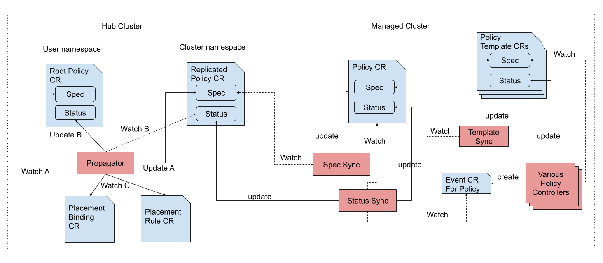

[comment]: # " Copyright Contributors to the Open Cluster Management project "

# Governance Policy Framework

[](https://github.com/stolostron/governance-policy-framework/actions/workflows/integration.yml)

Open Cluster Management - Governance Policy Framework

The policy framework provides governance capability to gain visibility, and drive remediation for
various security and configuration aspects to help meet such enterprise standards.

## What it does

View the following functions of the policy framework:

- Distributes policies to managed clusters from hub cluster.
- Collects policy execution results from managed cluster to hub cluster.
- Supports multiple policy engines and policy languages.
- Provides an extensible mechanism to bring your own policy.

## Architecture



The governance policy framework consists of the following components:

- Govenance policy framework: A framework to distribute various supported policies to managed
  clusters and collect results to be sent to the hub cluster. The framework replicates `Policy` Custom Resources (CRs) from the "user namespace" to the "cluster namespace" on the hub cluster. The `Policy` CRs in the "cluster namespace" are further replicated to the managed clusters.
  - [Policy propagator](https://github.com/stolostron/governance-policy-propagator)
  - [Governance policy framework addon](https://github.com/stolostron/governance-policy-framework-addon)
- Policy controllers: Policy engines that run on managed clusters to evaluate policy rules
  distributed by the policy framework and generate results. The results are reported back to the hub cluster.
  - [Configuration policy controller](https://github.com/stolostron/config-policy-controller)
    - [Usage examples](./doc/configuration-policy/README.md)
  - [Certificate policy controller](https://github.com/stolostron/cert-policy-controller)
  - Third-party (optional)
    - [Gatekeeper](https://github.com/open-policy-agent/gatekeeper)
    - [Kyverno](https://github.com/kyverno/kyverno/)

If desired, users can request automated actions to perform when a policy is violated. These automated actions consist of `PolicyAutomation` CRs and `AnsibleJob` CRs as shown in the hub cluster.

## The Policy CRDs

### Policy

The `Policy` is the Custom Resource Definition (CRD), created for policy framework controllers to
monitor. It acts as a vehicle to deliver policies to managed cluster and collect results to send to
the hub cluster.

View the following example specification of a `Policy` object:

```yaml
apiVersion: policy.open-cluster-management.io/v1
kind: Policy
metadata:
  name: policy-pod
spec:
  remediationAction: inform # [inform/enforce] If set, it defines the remediationAction globally.
  disabled: false # [true/false] If true, the policy will not be distributed to the managed cluster.
  policy-templates:
    - objectDefinition: # Use `objectDefinition` to wrap the policy resource to be distributed to the managed cluster
        apiVersion: policy.open-cluster-management.io/v1
        kind: ConfigurationPolicy
        metadata:
          name: policy-pod-example
        spec:
          remediationAction: inform
          object-templates:
            - complianceType: musthave
              objectDefinition:
                apiVersion: v1
                kind: Pod
                metadata:
                  name: sample-nginx-pod
                  namespace: default
                spec:
                  containers:
                    - image: nginx:1.7.9
                      name: nginx
                      ports:
                        - containerPort: 80
```

### PlacementBinding

The `PlacementBinding` CRD is used to bind the `Policy` with a `Placement`. Only a bound `Policy` is
distributed to a managed cluster by the policy framework.

View the following example specification of a `PlacementBinding` object:

```yaml
apiVersion: policy.open-cluster-management.io/v1
kind: PlacementBinding
metadata:
  name: binding-policy-pod
placementRef:
  name: placement-policy-pod
  kind: Placement
  apiGroup: cluster.open-cluster-management.io
subjects:
  - name: policy-pod
    kind: Policy
    apiGroup: policy.open-cluster-management.io
```

### Placement

The `Placement` CRD is used to determine the target clusters to distribute policies to.

View the following example specification of a `Placement` object:

```yaml
apiVersion: cluster.open-cluster-management.io/v1beta1
kind: Placement
metadata:
  name: placement-policy-pod
spec:
  predicates:
    - requiredClusterSelector:
        labelSelector:
          matchExpressions:
            - { key: environment, operator: In, values: ["dev"] }
  tolerations:
    - key: cluster.open-cluster-management.io/unreachable
      operator: Exists
    - key: cluster.open-cluster-management.io/unavailable
      operator: Exists
```

### PolicySet

The `PolicySet` CRD is used to group multiple policies and distribute them to a set of clusters. Each `Policy` in the `PolicySet` must be created in the same namespace as the `PolicySet`.

The following is an example `PolicySet` object specification:

```yaml
apiVersion: policy.open-cluster-management.io/v1beta1
kind: PolicySet
metadata:
  name: policy-set-pod
spec:
  policies:
    - name: policy-pod
    - name: policy-pod-security
    - name: policy-pod-network
```

 When a `PolicySet` is bound to a `Placement` with a `PlacementBinding`, enabled policies in the `PolicySet` are distributed to the clusters in the `Placement`, subject to exclusions. The `PolicySet` reports the overall compliance of the policies in the set.

The following example shows how to bind the `PolicySet` using `PlacementBinding`:

```yaml
apiVersion: policy.open-cluster-management.io/v1
kind: PlacementBinding
metadata:
  name: binding-policy-set-pod
placementRef:
  name: placement-policy-set-pod
  kind: Placement
  apiGroup: cluster.open-cluster-management.io
subjects:
  - name: policy-set-pod
    kind: PolicySet
    apiGroup: policy.open-cluster-management.io
```

Generally, policies within a `PolicySet` rely on the `Placement` bound to the `PolicySet`. It is not recommended to have individual placement bindings or placements for policies within a `PolicySet`, because it can lead to unexpected behavior if the multiple placements conflict with each other.

#### PolicySet Exclusions

The `Policy` CRD supports disabling a policy by setting the `disabled` field to `true`. When a policy is disabled, the policy will not be distributed to any clusters in the `Placement` bound to the `PolicySet`. This is useful when a policy is not ready to be enforced yet, or is causing disruption to **all** clusters in the `Placement`.

```yaml
apiVersion: policy.open-cluster-management.io/v1
kind: Policy
metadata:
  name: policy-pod-network
spec:
  remediationAction: enforce
  disabled: true # disabled on all clusters in the Placement bound to the PolicySet
```

For greater operational flexibility, the `PolicySet` CRD supports excluding a policy from a `PolicySet` by setting the `exclusions` field. When a policy is excluded, the policy will not be distributed to the list of  `clusterNames` in the exclusion. This is useful when a policy in a `PolicySet` is causing disruption to specific clusters in the `Placement`, and it is not practical to remove the policy from the `PolicySet` or disable the policy for all clusters in the `Placement`.

The following example shows a `PolicySet` object with exclusions. The optional `reason` field provides a human-readable explanation for each exclusion:

```yaml
apiVersion: policy.open-cluster-management.io/v1beta1
kind: PolicySet
metadata:
  name: policy-set-pod
spec:
  policies:
    - name: policy-pod
    - name: policy-pod-security
    - name: policy-pod-network
  exclusions:
    - clusterNames:
        - cluster1
        - cluster2
      policyName: policy-pod-network
      reason: "incident mitigation"
    - clusterNames:
        - cluster3
      policyName: policy-pod-security
      reason: "upgrade in progress"
```

Considerations when using exclusions:
- The exclusion will be ignored if another `PlacementBinding` binds the `Policy` to another `Placement` that includes the excluded cluster.
- Exclusions are intended for short-term use only. If a policy (or multiple policies) require a different set of target clusters long-term, it is recommended to remove the policies from the `PolicySet` and create a new `Placement` with the new set of target clusters.
- Disabling a `Policy` will disable the policy on all clusters in the `Placement` bound to the `PolicySet`, regardless of whether an exclusion is applied.
- The per-cluster `status` entry for a root `Policy` on an excluded cluster will be `Unknown`.
- When a cluster is removed from the exclusion list, the policy will be distributed to the cluster again if the cluster remains selected by the `Placement`.

## How to install it

You can find installation instructions from
[Open Cluster Management](https://open-cluster-management.io/) website.

## More policies

You can find more policies or contribute to the open repository,
[policy-collection](https://github.com/stolostron/policy-collection).

<!---
Date: 08/05/2026
-->
